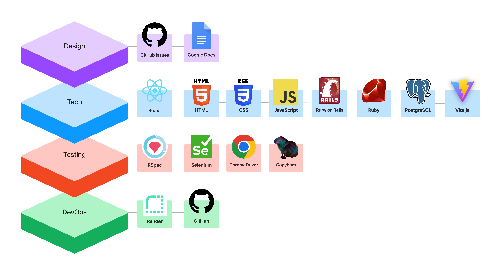
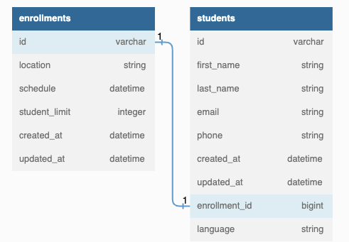

[![Contributors][contributors-shield]][contributors-url]
[![Forks][forks-shield]][forks-url]
[![Stargazers][stars-shield]][stars-url]
[![Issues][issues-shield]][issues-url]
[![License][license-shield]][license-url]

# Career Fair Registration

## Career Fair Registration Portal Documentation

<!-- TABLE OF CONTENTS -->
## Table of Contents

1. [About The Project](#about-the-project)
   - [Deployment Information](#deployment-information)
   - [Built With](#built-with)
   - [Database Schema](#database-schema)
2. [Getting Started](#getting-started)
   - [Prerequisites](#prerequisites)
   - [Installation](#installation)
   - [Usage](#usage)
     - [Repository Usage](#to-use-the-repository)
     - [Running Tests](#to-run-tests)
   - [Gems Utilized](#gems-utilized)
   - [JavaScript Packages Utilized](#javascript-packages-utilized)
3. [Roadmap](#roadmap)
   - [Initial Research and Decisions](#initial-research-and-decisions)
   - [Enrollment Management](#enrollment-managment)
   - [Prospective Student Features](#prospective-student-features)
   - [Admin Features](#admin-features)
   - [Database Enhancements](#database-enhancements)
   - [Deployment and Documentation](#deployment-and-documentation)
   - [Stretch Goals](#stretch-goals)
4. [Contact](#contact)
5. [Acknowledgments](#acknowledgments)
6. [License](#license)

<!-- ABOUT THE PROJECT -->
## About The Project

This project aims to create an online registration system for the career fair.

This web application harnesses React for frontend and Ruby on Rails for backend within a unique monolithic setup. It leverages HTML5, CSS3, JavaScript, Ruby, and PostgreSQL alongside Vite.js for a streamlined development experience.
For DevOps processes, it is recommended to use Render and GitHub to maintain a smooth and reliable release pipeline. 

[(back to top)](#top)

<!-- Deployment Information -->
### Deployment Information

Will add information as per future discussion.

[(back to top)](#top)

<!-- Built With -->
### Built With

[(back to top)](#top)

<!-- Database Schema -->
### Database Schema

[(back to top)](#top)

<!-- INSTALLATION -->
### Installation
Not up to date. Will update as per future discussion. The steps below are for the original repo (The Learning Source Enrollment Form).

Follow the steps below to install and set up the repository on your local machine:

1. Fork the repository.
2. Clone the forked repository to your local machine.
3. Open your console or terminal and navigate to the project directory.
4. Run `bundle install` to install the required Ruby gems.
5. Execute `bundle exec vite install` to set up Vite.
6. Run `npm install` to install the necessary npm packages.

[(back to top)](#top)

<!-- USAGE -->
### Usage

*Instructions to be added*

[(back to top)](#top)

<!-- TO USE THE REPOSITORY -->
#### To use the repository

*Instructions to be added*

[(back to top)](#top)

<!-- Gems Utilized -->
### Gems Utilized

The Career Fair Registration web app utilizes the following gems:

- [Ruby 3.1.1](https://www.ruby-lang.org/)
- [Rails 7.0.4](https://rubyonrails.org/) - Our web application framework.
- [sprockets-rails](https://github.com/rails/sprockets-rails) - Rails asset pipeline.
- [pg](https://rubygems.org/gems/pg/versions/0.18.4) - PostgreSQL database adapter.
- [puma](https://github.com/puma/puma) - A Ruby/Rack web server built for concurrency.
- [vite_rails](https://github.com/rails/vite_rails) - Integrates Vite with Rails.
- [tzinfo-data](https://github.com/tzinfo/tzinfo-data) - Provides daylight savings time (DST) data.
- [phonelib](https://github.com/daddyz/phonelib) - A library to validate phone numbers.
- [capybara](https://github.com/teamcapybara/capybara) - Helps you test web applications by simulating how a real user would interact with your app.
- [debug](https://github.com/ruby/debug) - A new Ruby debugging library (only for MRI and mingw platforms).
- [factory_bot_rails](https://github.com/thoughtbot/factory_bot_rails) - A fixtures replacement for focused and readable tests.
- [faker](https://github.com/faker-ruby/faker) - A library for generating fake data.
- [pry](https://github.com/pry/pry) - A runtime developer console and IRB alternative.
- [rspec-rails](https://github.com/rspec/rspec-rails) - Testing framework for Rails.
- [selenium-webdriver](https://www.selenium.dev/projects/webdriver/) - Tool for writing automated tests of websites.
- [shoulda-matchers](https://github.com/thoughtbot/shoulda-matchers) - Provides RSpec- and Minitest-compatible one-liners to test common Rails functionality.
- [rubocop-rails](https://github.com/rubocop/rubocop-rails) - Rails-specific static code analysis.
- [rubocop-rspec](https://github.com/rubocop/rubocop-rspec) - Code analyzer for RSpec files.
- [simplecov](https://github.com/simplecov-ruby/simplecov) - Code coverage analysis tool for Ruby.

[(back to top)](#top)

<!-- JavaScript Packages Utilized -->
### JavaScript Packages Utilized

The Learning Source Enrollment Registration utilizes the following JavaScript packages:

- [vite](https://vitejs.dev/): A build tool that aims to provide a faster and leaner development experience for modern web projects.
- [vite-plugin-ruby](https://github.com/ElMassimo/vite_ruby): A Vite.js plugin for better integration with Ruby on Rails.
- [@date-io/date-fns](https://github.com/dmtrKovalenko/date-io): A package to use date-fns with date-io.
- [@emotion/react](https://emotion.sh/docs/@emotion/react): A library for writing css styles with JavaScript.
- [@emotion/styled](https://emotion.sh/docs/@emotion/styled): A library for creating React components with style.
- [@fortawesome/fontawesome-svg-core](https://github.com/FortAwesome/Font-Awesome): The SVG core of Font Awesome.
- [@fortawesome/free-regular-svg-icons](https://github.com/FortAwesome/Font-Awesome): Regular style SVG icons from Font Awesome.
- [@fortawesome/free-solid-svg-icons](https://github.com/FortAwesome/Font-Awesome): Solid style SVG icons from Font Awesome.
- [@fortawesome/react-fontawesome](https://github.com/FortAwesome/react-fontawesome): Font Awesome React component.
- [@mui/base](https://mui.com/): The foundation of the MUI ecosystem, used by all MUI components.
- [@mui/lab](https://mui.com/components/about-the-lab/): MUI components that are in active development.
- [@mui/material](https://mui.com/): React components for faster and easier web development by MUI.
- [@mui/system](https://mui.com/system/basics/): Low-level utility functions called "style functions" for building powerful design systems by MUI.
- [@mui/x-date-pickers](https://mui.com/components/date-picker/): Date Picker component by MUI.
- [@vitejs/plugin-react](https://github.com/vitejs/vite/tree/main/packages/plugin-react): Official Vite plugin for React.
- [bootstrap](https://getbootstrap.com/): The most popular HTML, CSS, and JS library in the world for building responsive, mobile-first projects on the web.
- [date-fns](https://date-fns.org/): Modern JavaScript date utility library.
- [mdb-react-ui-kit](https://mdbootstrap.com/docs/b5/react/): UI Kit based on Bootstrap 5 for React by MDBootstrap.
- [react](https://reactjs.org/): A JavaScript library for building user interfaces.
- [react-bootstrap](https://react-bootstrap.github.io/): The most popular front-end framework, rebuilt for React.
- [react-bootstrap-icons](https://react-bootstrap-icons.netlify.app/): Bootstrap icons, but for React.
- [react-datetime-picker](https://www.npmjs.com/package/react-datetime-picker): A date/time picker for react (using bootstrap).
- [react-dom](https://reactjs.org/docs/react-dom.html): Serves as the entry point to the DOM and server renderers for React.

[(back to top)](#top)

<!-- CONTACT -->
## Contact

<table>
  <tr>
    <td></td>
  </tr>
  <tr>
    <td>Mostafa Sakr</td>
  </tr>
  <tr>
    <td>
       <a href="https://github.com/msakr21">GitHub</a> 
       <a href="https://linkedin.com/in/mostafasakr16/">LinkedIn</a>
    </td>
  </tr>
</table>

[(back to top)](#top)

<!-- LICENSE -->
## License

This project is licensed under the terms of the MIT license. For more details, see the [LICENSE](./LICENSE) file.

[(back to top)](#top)

<!-- MARKDOWN LINKS & IMAGES -->
[contributors-shield]: https://img.shields.io/github/contributors/msakr21/registration.svg?style=for-the-badge
[contributors-url]: https://github.com/msakr21/registration/graphs/contributors
[forks-shield]: https://img.shields.io/github/forks/msakr21/registration.svg?style=for-the-badge
[forks-url]: https://github.com/msakr21/registration/network/members
[stars-shield]: https://img.shields.io/github/stars/msakr21/registration.svg?style=for-the-badge
[stars-url]: https://github.com/msakr21/registration/stargazers
[issues-shield]: https://img.shields.io/github/issues/msakr21/registration.svg?style=for-the-badge
[issues-url]: https://github.com/msakr21/registration/issues
[license-shield]: https://img.shields.io/github/license/msakr21/registration.svg?style=for-the-badge
[license-url]: https://github.com/msakr21/registration/blob/main/LICENSE
